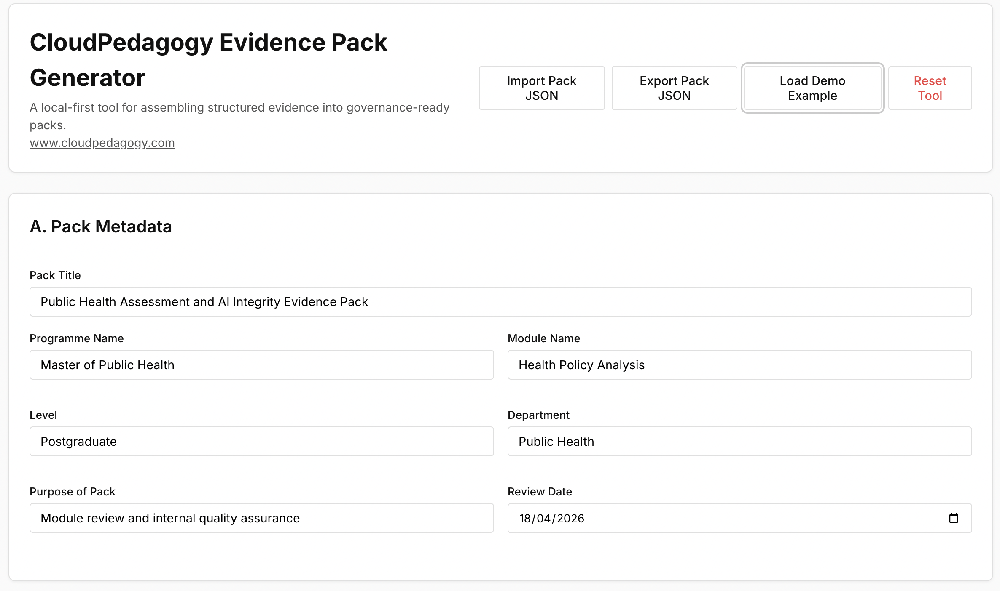

# Evidence & QA Pack Generator

A local-first tool for generating structured, governance-ready evidence packs from curriculum, assessment, and AI integrity designs.

🌐 **Live Hosted Version**  
http://cloudpedagogy-evidence-pack-generator.s3-website.eu-west-2.amazonaws.com/

🖼️ **Screenshot**  

---

## 🔗 Role in the CloudPedagogy Ecosystem

**Phase:** Phase 6 — Evidence, Quality & Change  

**Role:**  
Aggregates structured inputs from across the CloudPedagogy ecosystem and transforms them into readable, printable, and governance-ready evidence packs.

**Upstream Inputs:**  
- Assessment Design Engine outputs  
- AI Integrity Design Tool outputs  
- Curriculum and programme design data  

**Downstream Outputs:**  
- QA and accreditation documentation  
- Governance-ready summaries for review and approval  
- Evidence packs for institutional processes  

**Does NOT:**  
- Design curriculum or assessments  
- Define AI integrity policies  
- Perform governance analysis  

---

## Overview

The **Evidence & QA Pack Generator** connects design activity to institutional processes.

It enables educators, programme teams, and institutions to:
- combine structured inputs into a single evidence pack  
- generate clear, readable summaries for review  
- support quality assurance, accreditation, and governance workflows  
- produce outputs that are suitable for documentation and decision-making  

This helps ensure that design work becomes:
- visible  
- structured  
- reviewable  
- institutionally aligned  

---

## Key Features

- **Evidence Aggregation**  
  Combine inputs from multiple CloudPedagogy tools  

- **Structured Output Generation**  
  Create readable, report-style evidence packs  

- **Editable Sections**  
  Refine generated content while maintaining structure  

- **Print & Export Support**  
  Produce outputs suitable for QA and accreditation  

---

## Additional Documentation

- [User Instructions](./INSTRUCTIONS.md)
- [Project Specification](./PROJECT_SPEC.md)

---

## Technical Overview

- Built with TypeScript + Vite (React)  
- Fully local-first — runs entirely in the browser  
- Uses localStorage for persistence  
- Supports JSON import/export  
- No backend or external data storage  

---

## Run Locally

npm install  
npm run dev  

---

## Build

npm run build  

---

## Design Principles

- Local-first and inspectable  
- Governance-aware by design  
- Structured, not automated decision-making  
- Supports human judgement rather than replacing it  

---

## Disclaimer

This repository contains exploratory, framework-aligned tools developed for reflection, learning, and discussion.

These tools are provided as-is and are not production systems, audits, or compliance instruments. Outputs are indicative only and should be interpreted using professional judgement.

- All applications run locally in the browser  
- No user data is collected, stored, or transmitted  
- All example data is synthetic and does not represent real institutions or programmes  

---

## About CloudPedagogy

CloudPedagogy develops open, governance-credible tools for building confident, responsible AI capability across education, research, and public service.

- Website: https://www.cloudpedagogy.com/  
- Framework: https://github.com/cloudpedagogy/cloudpedagogy-ai-capability-framework  
